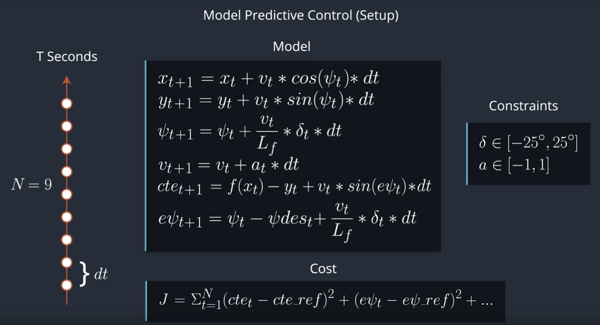

# MPC - Model Predictive Control

Implementation of a Model Predictive Control to drive the car around the simulator track.

---
## Background
To drive a car autonomously around a track the `steering` and `throttle/brake` needs to be controlled. One could use a [PID controller](https://github.com/mohanaravind/PID) but the limitation with such controller is they could be used only with systems that are almost instantaneous. In other words with systems that has almost no latency. Real car actuator systems has a level of latency between the time when we signal a change from controller and the actual actuator performing an action. This is where MPC does a better job than a PID controller. MPC predicts the actuation that is necessary to create a desired path in the future. It uses model of the system to perform its prediction and optimises the independent variables against a cost function. 


Check out the video on [YouTube](https://www.youtube.com/watch?v=XAxl9Q1237E)


## Model
`[x,y,ψ,v]` is the state of the vehicle, `Lf`
​	  is a physical characteristic of the vehicle, and `[δ,a]` are the actuators, or control inputs, to our system

Symbol | Meaning
---- | ----
x | Offset state in forward/backward direction
y | Offset state in left/right direction
ψ | Psi or orientation of the vehicle
v | Velocity of the vehicle
δ | Delta or Steer value
a | Throttle or brake


We use a `Kinematic Model` which is not an accurate description of the vehicle Physics but is more tractable.
Using a `Dynamic Model` would mean we have to take into account of tire forces, longitudinal and lateral forces, intertia, gravity, air resistance, drag, mass, and the geometry of the vehicle.

## The Setup



1. Convert the waypoints from the simulator global system to orient it with vehicle. This lets us keep the vehicle state `x,y,ψ` to 0 at every computation
2. Fit a 3rd order Polynomial to fit a curve through our waypoints. We make use of [this library](https://github.com/JuliaMath/Polynomials.jl/blob/master/src/Polynomials.jl#L676-L716) to do this.
3. Call the MPC function to solve
4. Return the actuation (Steer and throttle) values
5. Return the waypoints of both planned path and trajectory that was simulated

### Hyperparameters
Parameter | Tuned Value
------- |--------
N (Timestep length) | 10
dt (Duration) | 0.1

These parameters were tuned by trial and modify method. Initial values that I tried was `30, 20, 5, 8`.
Higher the value of time step greater the time taken to solve. This created a bigger latency between the actuation. Reducing the timestep too much resulted in greater fluctuation of actuator value. Duration was chosen with reference to the existing latency in the system. In this problem we have the latency of the system as `100 milliseconds` and starting with a value of `0.01` and increasing it gradually brought the current value of duration. Having too less duration doesn't allow the system to plan ahead of time. The prediction part of MPC gets affected.

What I realized tuning these hyperparameters is they can make a big difference in the controller. Difference between `0.2` and `0.1` for the duration value (dt) is a big deal in this model

### Cost Function
Control the system by punishing it more when it deviates from the original track. The weight `5000` is to give more importance to this in the cost. Orientation of the vehicle gets a lesser weight of `2000`. Keeping the reference velocity at 70 we dont try to maximize this effect.

``` C++
  cost += 500 * CppAD::pow(vars[cte_start + t], 2);
  cost += 500 * CppAD::pow(vars[epsi_start + t], 2);
  cost += 4 * CppAD::pow(vars[v_start + t] - ref_v, 2);
```

To avoid fluctuation of control signals we would have to reduce the actuation of actuators
``` c++
  cost += 150 * CppAD::pow(vars[delta_start + t], 2);
  cost += 150 * CppAD::pow(vars[a_start + t], 2);
```

To avoid motion sickness for the passengers and allow a smooth drive we try to minimize the gap between sequential actuations
``` c++
  cost += 15 * CppAD::pow(vars[delta_start + t + 1] - vars[delta_start + t], 2);
  cost += 15 * CppAD::pow(vars[a_start + t + 1] - vars[a_start + t], 2);
```

We could add other factors as part of the cost function. The weights that has been used to drive these cost functions play a major role in fine tuning the controller

### Solver (Simulation)
We create the necessary independent variables for solver to work on. The solver assumes all the `independent variables, constraints and boundaries` defined as a single vector. We dynamically define the vector size and add items to this as per our `Timestep length hyper parameter (N)`. For every `dt` duration the new state is simulated using our Kinematic model that we have defined. The solver finds the right actuator values (`Steer and throttle`) that will minimize our overall cost. At every new actuation step we discard the old simulation values and start the simulation as fresh simulation. The reason being the system in reality might get affected by many other physical factor that is not accounted in our kinematic model.

#### Constraints & Boundaries
Constraints and boundaries helps the solver be aware of the flexibility it has to find the right actuator values with the minimal of cost. We define the kinematic model as part of the solver constraint. Boundaries for the independent variables are kept as `-1.0e19 to 1.0e19`. These are the maximum negative and positive values. Boundaries for the acceleration/decleration (throttle/brake) are kept at `-1.0 to 1.0`. The upper and lower limits of the steering angle are kept at `-25 to +25 degrees`.


#### Adjusting for latency

##### Initial method (Average)

The simulation system has a latency of 100 millisecond. We overcome this latency by taking the average values of steer and throttle for the last 3 simulated timestep

``` c++
  double steer_val = (solution.x[delta_start] + solution.x[delta_start + 1] + solution.x[delta_start + 2]) / 3.0;
  double throttle_val = (solution.x[a_start] + solution.x[a_start + 1] + solution.x[a_start + 2] ) / 3.0;
```

This will not work when the car should make a hard left, go straight, then hard right. The car would end up going straight.

##### Better method (next time step)

Getting the steer and throttle value in the next time step.

``` c++

prev_delta = solution.x[delta_start+fixed_steps];
prev_a = solution.x[a_start+fixed_steps];

```

## Dependencies

* cmake >= 3.5
 * All OSes: [click here for installation instructions](https://cmake.org/install/)
* make >= 4.1(mac, linux), 3.81(Windows)
  * Linux: make is installed by default on most Linux distros
  * Mac: [install Xcode command line tools to get make](https://developer.apple.com/xcode/features/)
  * Windows: [Click here for installation instructions](http://gnuwin32.sourceforge.net/packages/make.htm)
* gcc/g++ >= 5.4
  * Linux: gcc / g++ is installed by default on most Linux distros
  * Mac: same deal as make - [install Xcode command line tools]((https://developer.apple.com/xcode/features/)
  * Windows: recommend using [MinGW](http://www.mingw.org/)
* [uWebSockets](https://github.com/uWebSockets/uWebSockets)
  * Run either `install-mac.sh` or `install-ubuntu.sh`.
  * If you install from source, checkout to commit `e94b6e1`, i.e.
    ```
    git clone https://github.com/uWebSockets/uWebSockets
    cd uWebSockets
    git checkout e94b6e1
    ```
    Some function signatures have changed in v0.14.x. See [this PR](https://github.com/udacity/CarND-MPC-Project/pull/3) for more details.

* **Ipopt and CppAD:** Please refer to [this document](https://github.com/udacity/CarND-MPC-Project/blob/master/install_Ipopt_CppAD.md) for installation instructions.
* [Eigen](http://eigen.tuxfamily.org/index.php?title=Main_Page). This is already part of the repo so you shouldn't have to worry about it.
* Simulator. You can download these from the [releases tab](https://github.com/udacity/self-driving-car-sim/releases).
* Not a dependency but read the [DATA.md](./DATA.md) for a description of the data sent back from the simulator.


## Basic Build Instructions

1. Clone this repo.
2. Make a build directory: `mkdir build && cd build`
3. Compile: `cmake .. && make`
4. Run it: `./mpc`.


## Project Instructions and Rubric

Note: regardless of the changes you make, your project must be buildable using
cmake and make!

More information is only accessible by people who are already enrolled in Term 2
of CarND. If you are enrolled, see [the project page](https://classroom.udacity.com/nanodegrees/nd013/parts/40f38239-66b6-46ec-ae68-03afd8a601c8/modules/f1820894-8322-4bb3-81aa-b26b3c6dcbaf/lessons/b1ff3be0-c904-438e-aad3-2b5379f0e0c3/concepts/1a2255a0-e23c-44cf-8d41-39b8a3c8264a)
for instructions and the project rubric.


## Future
* Can we connect PID and MPC for a use case ?
* Improving the parameters and auto-tuning the controllers ?

